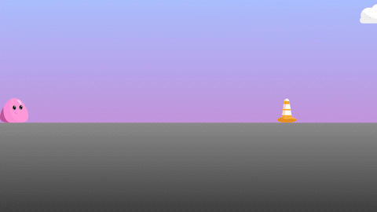

<h1>🕹️ Slime Jump Game</h1>

A proposta era criar um jogo simples endless runner, onde nosso personagem é um slime passeando pela cidade e deve evitar os obstáculos, quando ele bate em algum o jogo acaba.

As artes foram criadas por mim utilizando o Adobe Ilustrator e as animações foram feitas com o CSS

  <h2>Tecnologias usadas<h2>
  
  
  

  <h2>Resultado</h2>
  

